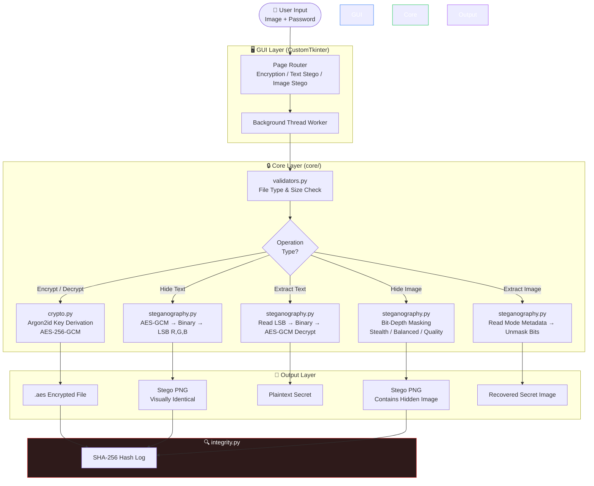
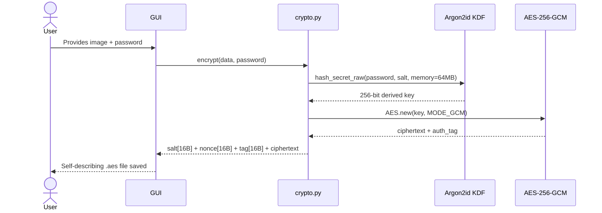

<div align="center">

# 🛡️ SubDaemon v2

### **The production-grade Python toolkit that silently monitors, encrypts, and steganographically conceals sensitive image data — so your secrets stay invisible.**

<br>


</div>

---

## 📋 Table of Contents

- [Executive Summary](#-executive-summary)
- [Key Features](#-key-features)
- [Technical Architecture](#-technical-architecture)
- [Quick Start](#-quick-start)
- [Usage Examples](#-usage-examples)
- [Security Methodology](#-security-methodology)
- [Security Considerations](#️-security-considerations)
- [Project Structure](#-project-structure)
- [Contributing](#-contributing)

---

## 🧠 Executive Summary

In an era where data breaches cost organizations an average of **$4.88 million per incident** (IBM, 2024), conventional encryption is no longer enough. Adversaries don't just break encryption — they identify *that* encryption exists, triggering forensic investigations and legal exposure.

**SubDaemon v2** was built to solve a two-layer problem that current security tooling ignores:

> *How do you protect sensitive image data not just from being read — but from being **detected** in the first place?*

By combining **AES-256-GCM authenticated encryption** with **LSB steganography**, SubDaemon v2 ensures that sensitive visual data is both cryptographically unreadable and visually undetectable. Built for researchers, security engineers, and forensic investigators who require deniability without sacrificing auditability.

---

## ✨ Key Features

| Feature | Description |
|---|---|
| 🔐 **AES-256-GCM Encryption** | Military-grade authenticated encryption with tamper detection. Wrong password or file corruption raises an immediate exception — no silent failures. |
| 🖼️ **LSB Text Steganography** | Hide encrypted secret messages inside ordinary PNG images using Least Significant Bit encoding across all three RGB channels for 3× capacity. |
| 🪆 **Image-in-Image Concealment** | Embed a full secret image inside a cover image using configurable bit-depth modes — Stealth (3-bit), Balanced (4-bit), or Quality (5-bit). |
| 🖥️ **Modern Desktop GUI** | A clean, dark-mode CustomTkinter interface with background-threaded operations — the UI never freezes during heavy cryptographic workloads. |

---

## 🏗️ Technical Architecture

The system is structured in strict layers. The `core/` module has **zero GUI dependency** — every backend function is independently testable and reusable via CLI or API.

### System Data Flow



### Encryption Sequence



---

## 🚀 Quick Start

### Prerequisites

- Python **3.10+**
- `pip` package manager
- Git

### Installation

```bash
# 1. Clone the repository
git clone https://github.com/shanid/subdaemon-v2.git
cd subdaemon-v2

# 2. Create and activate a virtual environment
python -m venv venv

# On Windows
venv\Scripts\activate

# On macOS / Linux
source venv/bin/activate

# 3. Install all dependencies
pip install -r requirements.txt

# 4. Launch the application
python main.py
```

### requirements.txt

```
customtkinter>=5.2.0
pycryptodome>=3.20.0
argon2-cffi>=23.1.0
Pillow>=10.0.0
numpy>=1.26.0
pytest>=8.0.0
```

> [!IMPORTANT]
> Always use a **virtual environment**. Installing `pycryptodome` globally can conflict with `pycrypto` if it exists on your system, leading to silent import failures that are difficult to debug.

---

## 💻 Usage Examples

### 🔐 Encrypt & Decrypt a File (Python API)

```python
from core.crypto import encrypt, decrypt
from core.exceptions import AuthenticationError

# --- Encryption ---
with open("sensitive_photo.png", "rb") as f:
    raw_data = f.read()

encrypted_blob = encrypt(raw_data, password="YourStr0ngP@ssword!")

with open("output.aes", "wb") as f:
    f.write(encrypted_blob)

print("✅ File encrypted. Self-describing blob saved.")

# --- Decryption ---
with open("output.aes", "rb") as f:
    blob = f.read()

try:
    original_data = decrypt(blob, password="YourStr0ngP@ssword!")
    with open("recovered.png", "wb") as f:
        f.write(original_data)
    print("✅ File decrypted successfully.")

except AuthenticationError:
    print("❌ Wrong password or file has been tampered with.")
```

### 🖼️ Hide & Extract Text in an Image

```python
from core.steganography import hide_text, extract_text

# Hide an AES-encrypted secret message inside a cover image
hide_text(
    cover_path="cover_photo.png",
    output_path="innocent_looking_photo.png",
    secret="Meet at the usual place. 22:00.",
    password="YourStr0ngP@ssword!"
)
print("✅ Message hidden. Image is visually identical to the original.")

# Extract and decrypt the message
message = extract_text(
    stego_path="innocent_looking_photo.png",
    password="YourStr0ngP@ssword!"
)
print(f"📨 Extracted message: {message}")
```

### 🪆 Hide an Image Inside Another Image

```python
from core.steganography import hide_image, extract_image

# Hide a secret image using stealth mode (3-bit, minimal visual impact)
hide_image(
    cover_path="landscape.png",
    secret_path="classified_diagram.png",
    output_path="stego_landscape.png",
    mode="stealth"   # options: "stealth" | "balanced" | "quality"
)

# Extract — mode is auto-detected from embedded metadata
extract_image(
    stego_path="stego_landscape.png",
    output_path="recovered_diagram.png"
)
```

> [!NOTE]
> SubDaemon v2 **enforces PNG format** on all stego outputs. JPEG compression uses lossy algorithms that destroy LSB-encoded data, making recovery impossible. Never save a stego image as `.jpg`.

---

## 🔬 Security Methodology

SubDaemon v2's security model is built on three pillars, each chosen based on current cryptographic standards and peer-reviewed research.

### Pillar 1 — Memory-Hard Key Derivation (Argon2id)

Password-based key derivation is the most commonly exploited weakness in encryption tools. SHA-256, used naively, allows an attacker with a GPU cluster to test **billions of passwords per second**.

SubDaemon v2 uses **Argon2id** — the winner of the Password Hashing Competition (PHC, 2015) and recommended by NIST SP 800-63B. The `memory_cost=65536` (64MB) parameter ensures that each password guess requires 64MB of RAM, reducing GPU parallelism from billions to thousands of guesses per second.

| Algorithm | Guesses/sec (GPU) | Memory Required |
|---|---|---|
| SHA-256 (raw) | ~8 billion | Negligible |
| PBKDF2-SHA256 | ~500 million | Negligible |
| bcrypt | ~20,000 | 4 KB |
| **Argon2id (SubDaemon v2)** | **~5,000** | **64 MB** |

### Pillar 2 — Authenticated Encryption (AES-256-GCM)

AES-CBC, used in many implementations, provides confidentiality but **not integrity**. An attacker can flip bits in a CBC ciphertext and the decryption will silently produce corrupted plaintext with no error raised.

AES-GCM produces an **authentication tag** during encryption. On decryption, if even a single bit has changed — due to tampering, transmission error, or storage corruption — a `ValueError` is raised immediately. SubDaemon v2 maps this to a meaningful `AuthenticationError` exception.

### Pillar 3 — LSB Steganography with Encrypted Payload

Hiding plaintext data in an image's LSBs provides concealment but no security — any LSB steganalysis tool can extract it. SubDaemon v2 hides an **AES-GCM encrypted ciphertext** inside the image, so even if an analyst detects and extracts the hidden data, they retrieve meaningless ciphertext without the password.

The payload format uses a **4-byte length header** rather than an end marker, eliminating false termination if the encrypted data coincidentally contains the marker bit pattern.

```
Payload Layout: [ LENGTH (4 bytes) ][ AES-GCM BLOB (N bytes) ]
Embedded in:    R-LSB, G-LSB, B-LSB of each pixel (3 bits per pixel)
```

---

## ⚠️ Security Considerations

> [!IMPORTANT]
> **SubDaemon v2 is a research and educational tool.** It has not undergone a third-party security audit. Do not use it as the sole protection layer for highly sensitive production data without independent review.

> [!WARNING]
> **Steganography is not a substitute for encryption.** LSB steganography can be detected by statistical steganalysis tools (e.g., StegExpose, SteghideDetect). SubDaemon v2 mitigates this by encrypting the payload before hiding it — but the *existence* of hidden data may still be detectable by a sufficiently motivated analyst. Use steganography as a supplementary layer, not a primary defence.

> [!CAUTION]
> **Password strength is your weakest link.** Argon2id raises the cost of brute-force attacks dramatically, but a weak password (e.g., `password123`) remains vulnerable. Always use passwords with minimum 16 characters, mixed case, numbers, and symbols. Consider using a password manager to generate credentials.

---

## 📁 Project Structure

```
subdaemon-v2/
│
├── core/                   # Pure backend — zero GUI dependency
│   ├── crypto.py           # Argon2id + AES-256-GCM encrypt/decrypt
│   ├── steganography.py    # LSB text & image-in-image steganography
│   ├── integrity.py        # SHA-256 file hashing & PNG validation
│   └── exceptions.py       # AuthenticationError, CapacityError, etc.
│
├── gui/                    # All CustomTkinter UI code
│   ├── app.py              # Main window & page router
│   ├── pages/              # Encryption, Text Stego, Image Stego pages
│   └── components/         # Reusable widgets (PasswordField, ImagePreview)
│
├── utils/
│   ├── file_handler.py     # Safe file I/O with type verification
│   └── validators.py       # Input validation & capacity checks
│
├── tests/                  # pytest test suite
│   ├── test_crypto.py
│   ├── test_steganography.py
│   └── test_integrity.py
│
├── assets/                 # Icons and fonts
├── requirements.txt
├── main.py                 # Single entry point
└── README.md
```

---

## 🤝 Contributing

Contributions, issues, and feature requests are welcome!

1. **Fork** the repository
2. Create a feature branch: `git checkout -b feature/your-feature-name`
3. Commit your changes: `git commit -m 'feat: add your feature'`
4. Push to the branch: `git push origin feature/your-feature-name`
5. Open a **Pull Request**

Please ensure all new features are covered by tests in `tests/` and pass `pytest` before submitting.

---

<div align="center">

**If SubDaemon v2 helped your research, please consider giving it a ⭐ — it helps others find the project.**

[](https://github.com/shanid/subdaemon-v2)

<br>

Made with 🔐 by **Mohammed Shanid**

*B.Tech Computer Science & Engineering — Cybersecurity*

**Srinivas University**, Mangalore, Karnataka, India

<br>

*"Security is not a product, but a process."* — Bruce Schneier

</div>
